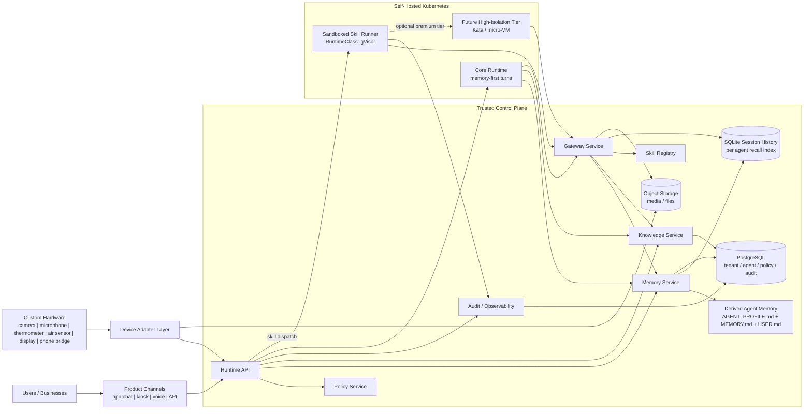
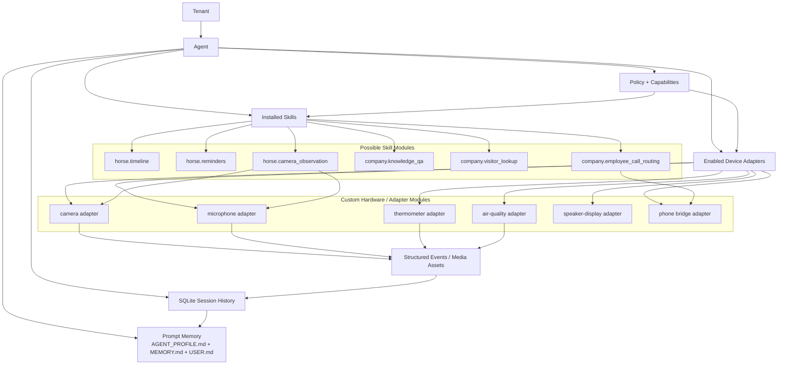

# MYNAH Global Specification

Version: 0.3-global-framework
Status: Draft
Last updated: 2026-03-11

## 1. Purpose
MYNAH is a secure, tenant-aware agent framework for building tailored agents for users and businesses.

It is not a direct end-user app.
It is the backend platform used to deliver product-specific agents such as:
- a horse management assistant with persistent memory
- a receptionist agent for a company front desk
- later domain-specific multimodal agents with attached hardware

The framework must optimize for:
- security
- stability
- low operating cost
- scalability

## 2. Product Vision
MYNAH should let us offer "agent as a service" from one consistent platform.

The platform should support:
- shared multi-tenant hosting
- dedicated single-tenant deployments
- later on-prem deployments

The same core system should power:
- simple memory-first agents
- agents with a small number of sealed skills
- agents with optional multimodal and hardware-backed capabilities

MYNAH is not intended to be:
- a general autonomous assistant platform
- a free-form tool playground
- a user-programmable agent shell in v0

## 3. Core Product Positioning
The commercial shape of MYNAH is:
- a secure agent core
- persistent memory by default
- optional sealed skill modules
- optional dedicated device adapters
- tailored product experiences built on top

This is the core USP:
- memory-first agents that feel persistent and contextual
- controlled customization through skills
- custom multimodal setups through dedicated hardware
- a stronger security and stability story than broad consumer agent frameworks

## 4. Core Principles
1. Security is the primary design driver.
   - The trust boundary must live in infrastructure and code, not only in prompts.

2. Memory is built in.
   - Every agent has persistent memory capability.
   - Memory is not an optional plugin.

3. Skills are optional and sealed.
   - Skills are operator-installed, versioned, permission-scoped, and immutable at runtime.

4. Persona is not policy.
   - The "digital horse twin" or "digital receptionist" is presentation.
   - Real system boundaries come from policy, capability grants, and sandboxing.

5. Multi-tenancy is a first-class concern.
   - The framework must be tenant-aware from the beginning.
   - Dedicated deployments are a packaging choice, not a different product architecture.

6. The common case must stay cheap.
   - Most agents should run as memory-first agents with few or no skills.
   - Expensive isolation should be applied where risk or value justify it.

7. Determinism is preferred where practical.
   - Validation, memory writes, policy checks, skill contracts, and audit trails should be explicit and inspectable.

## 5. Goals
- Provide a reusable backend for multiple agent products
- Support persistent, scoped, contextual memory
- Support optional sealed skills and hardware/device integrations
- Enforce strong isolation between tenants, skills, and systems
- Run economically on self-hosted Linux infrastructure
- Scale from early customers to many tenants without redesigning the core model

## 6. Non-Goals
- user-authored arbitrary runtime code in v0
- self-modifying skills in v0
- unrestricted browser or shell automation in v0
- unconstrained tool ecosystems in v0
- broad autonomous planning loops without hard product boundaries
- treating prompts as the primary security mechanism

## 7. Tenant-Agent Model
MYNAH is built around three primary business entities:

- `tenant`
  - the customer boundary
  - can be an end user, team, or company

- `agent`
  - a configured runtime instance inside a tenant
  - examples:
    - horse twin
    - receptionist
    - care companion

- `user`
  - an identified human interacting with one agent
  - every session belongs to exactly one user
  - if identity is not already known from login, channel, or operator context, the framework should require clarification before durable user-scoped memory is created

In most product cases, one agent represents one primary real-world entity or role.
Examples:
- one horse = one agent
- one receptionist = one agent

An additional `subject` abstraction may be introduced later if a concrete product needs it, but it is not part of the core v0 model.

This model allows the same framework to support:
- many small end-user agents
- one company-wide assistant
- multiple agents inside one tenant when needed

For single-user products, one user may dominate most sessions for one agent.
For multi-user products, one shared agent can serve many users while user-scoped context stays separate.

## 8. Core Domain Entities
The initial platform should define these core entities:

- `tenant`
- `agent`
- `channel`
- `session`
- `user`
- `policy`
- `capability_grant`
- `knowledge_asset`
- `memory_snapshot`
- `skill`
- `skill_installation`
- `device_adapter`
- `sandbox_execution`
- `audit_event`

### 8.1 Entity Intent
- `channel`
  - where the interaction happens
  - examples: app chat, kiosk, voice, API
- `session`
  - bounded interaction span on one channel
- `user`
  - one identified human participant for a session
- `policy`
  - hard product and security rules for one agent
- `capability_grant`
  - explicit permissions assigned to the agent or skill
- `knowledge_asset`
  - imported or curated structured/unstructured knowledge
- `memory_snapshot`
  - bounded persistent memory files and their current rendered state
- `skill`
  - a sealed behavior module
- `skill_installation`
  - activation of a skill for one agent
- `device_adapter`
  - controlled integration for camera, microphone, sensor, or actuator
- `sandbox_execution`
  - auditable record of isolated execution
- `audit_event`
  - cross-cutting operational and security event record

## 9. Architecture Overview
MYNAH should be divided into these major subsystems:

1. Control plane
   - tenant, agent, skill, policy, and deployment management

2. Runtime API
   - request handling for text, image, and later multimodal interactions

3. Memory system
   - event capture, semantic extraction, retrieval, and memory policy

4. Skill system
   - manifest validation, capability checks, dispatch, and sandbox execution

5. Device adapter layer
   - normalized access to cameras, microphones, sensors, displays, and bridges

6. Knowledge layer
   - curated company/domain knowledge and retrieval support

7. Audit and observability layer
   - action logs, policy decisions, execution traces, and operator control hooks

### 9.1 High-Level Architecture Diagram

### 9.2 Skill and Hardware Modularity Diagram

## 10.1 Control Plane and Execution Plane
MYNAH should explicitly separate:
- `control plane`
  - trusted services that hold durable state and real credentials
- `execution plane`
  - disposable runtimes that execute isolated agent or skill workloads with minimal privileges

The control plane should own:
- tenant and agent configuration
- policy
- capability grants
- memory persistence
- knowledge access
- model/provider credentials
- audit logging
- billing and limit enforcement later

The execution plane should own:
- temporary runtime state
- bounded workspace files
- isolated skill execution
- optional isolated full-agent execution in higher-security tiers later

This split is a core architectural pattern for the platform.

## 10. Request Lifecycle
The baseline request flow is:

1. A request enters through a channel
2. The runtime resolves:
   - tenant
   - agent
   - session
3. Policy and capability checks are loaded
4. Retrieval gathers:
   - current bounded memory snapshot
   - relevant session history recall
   - knowledge assets
   - active policy instructions
5. The model produces a response plan
6. If a skill is needed:
   - capability check runs
   - skill manifest is validated
   - execution is dispatched to the correct sandbox runtime
7. The user-facing response is generated
8. A bounded memory pipeline runs after the response
9. Audit records are written

This flow should support:
- memory-only turns
- knowledge retrieval turns
- skill-assisted turns
- later multimodal turns

### 10.2 Disposable Execution Principle
Sandboxed execution should have:
- nothing worth stealing
- nothing worth preserving

This means:
- no durable memory state inside the sandbox
- no database credentials inside the sandbox
- no cloud provider credentials inside the sandbox
- no broad internal network access inside the sandbox
- no assumption that a sandbox survives across restarts

All durable truth should stay in the control plane or canonical storage systems outside the sandbox.

## 11. Memory Philosophy
Memory is one of the core reasons to build MYNAH.

The system should feel like:
- it remembers important things over time
- it can decide what matters
- it can answer naturally from persistent context

But the implementation must remain:
- structured
- auditable
- tenant-scoped
- policy-controlled

This means we want the user experience of natural persistent memory without allowing unconstrained memory writes.

## 12. Hermes-Aligned Memory Direction
MYNAH should intentionally align with Hermes on the high-level memory pattern, especially:
- persistent cross-session memory
- an agent-driven sense of what is worth remembering
- lightweight recall from prior context
- bounded memory updates after interaction

What we want to preserve from that philosophy:
- the agent should not require the user to manually tag every memory
- the system should decide when something is worth writing
- memory should improve over time and make the agent feel persistent

What MYNAH must change from Hermes:
- memory must be scoped per tenant and per agent
- memory writes must go through validation and policy gates
- memory cannot become a silent prompt-injection or cross-tenant leak vector
- session history must work in a hosted multi-tenant environment rather than a single local user workspace

In short:
- keep the memory pattern
- adapt the hosting and tenancy model

## 13. Memory Model
The initial memory model has four parts:

1. `MEMORY.md`
   - bounded curated persistent memory for one agent
   - contains distilled important facts, routines, preferences, lessons, stable context, and important outcomes worth remembering
   - small enough to inject into the system prompt every session

2. `AGENT_PROFILE.md`
   - bounded profile-style memory for one agent
   - contains identity, communication style, long-lived role information, and other developer/operator-defined framing

3. `USER.md`
   - bounded user-scoped profile memory for one identified user interacting with one agent
   - contains user name, preferences, communication style, recurring habits, and other durable user-specific facts
   - when a new identified user starts a session with an agent, a new user-scoped `USER.md` should be created automatically

4. `SQLite session history`
   - full long-term conversation and interaction archive
   - used for on-demand recall rather than always-on prompt injection

### 13.1 Context Ownership
The memory-related context types are intentionally different:

- `AGENT_PROFILE.md`
  - developer or operator defined
  - describes who the agent is

- `MEMORY.md`
  - agent-learned shared durable context
  - stores facts about the agent, subject, environment, routines, and shared ongoing context across users

- `USER.md`
  - agent-learned user-scoped durable context
  - stores facts about one specific user

- `knowledge`
  - imported or curated reference material
  - not conversation-owned memory

- `session history`
  - chronological source material for recall and later derivation

Agent-learned and user-scoped are not opposites.
Both `MEMORY.md` and `USER.md` can be filled from interaction learning.
The difference is whose durable context the information belongs to.

### 13.2 Frozen Snapshot Rule
For one request or session start, the injected prompt memory is treated as a frozen snapshot.

This means:
- `MEMORY.md`, `AGENT_PROFILE.md`, and the current session user's `USER.md` are read before response generation
- writes that happen later in the turn are durable for future turns
- those writes do not mutate the already-built prompt for the current turn

This keeps memory behavior inspectable, avoids mid-turn prompt drift, and matches the low-cost memory-first design.

### 13.3 Required Session Scope
Every session must be scoped by:
- `tenant_id`
- `agent_id`
- `user_id`
- channel metadata
- time metadata

If a stable `user_id` is not already available, the system should require identification before durable user-scoped memory is created.

### 13.4 Required Memory Scope
Every memory artifact must be scoped by:
- `tenant_id`
- `agent_id`
- `user_id` when the artifact is user-scoped
- source channel or source system
- time metadata
- provenance metadata

Minimum v0 provenance for every accepted memory update:
- `session_id`
- `user_id`
- source turn timestamp
- revision reason
- whether the accepted result was written to `MEMORY.md` or `USER.md`

This does not require a heavy database-first provenance model in v0.
The main requirement is that accepted memory writes remain reconstructable and inspectable.

### 13.5 Required Memory Properties
- auditable
- reconstructable
- policy-scoped
- searchable
- safe against accidental cross-tenant leakage

### 13.6 Why This Model
This keeps the main benefits of Hermes:
- small always-on persistent memory
- long-term searchable session archive
- natural feeling recall
- bounded prompt cost

And it fits MYNAH because:
- each agent is the main unit of memory
- user-scoped memory can stay separate when many people use one agent
- memory remains easy to inspect and debug
- session history remains available for deeper recall without bloating every prompt

## 14. Memory Pipeline
The memory pipeline should run as a bounded internal step, usually after response generation.

The pipeline decides whether to:
- store nothing
- update `MEMORY.md`
- update the current user's `USER.md`
- mark a reminder candidate
- persist the interaction into session history

### 14.0 v0 Memory Revision Contract
The v0 memory pipeline should be treated as an explicit contract, not an implicit prompt side effect.

For each completed turn, the runtime may produce one bounded memory revision result with:
- revised `MEMORY.md`
- revised current-user `USER.md`
- revision reason
- minimal provenance fields

The revision step may propose changes, but the runtime decides what is actually persisted.

The runtime must:
- apply explicit memory operations against the current `MEMORY.md` and `USER.md`
- validate the resulting `MEMORY.md`
- validate the resulting `USER.md`
- reject low-value, unsafe, or invalid revisions
- persist accepted revisions atomically

The runtime must not:
- mutate `AGENT_PROFILE.md` from ordinary user turns
- persist memory without a resolved `user_id`
- trust the model as the final authority on scope
- accept revisions that exceed bounded document limits

### 14.0.1 v0 Revision Shape
The practical v0 revision shape is:
- `operations[]`
- `operations[].target`
- `operations[].action`
- `operations[].content`
- `operations[].old_text`
- `reason`

The operation contract is:
- `target`
  - `memory` or `user`
- `action`
  - `add`, `replace`, or `remove`
- `content`
  - required for `add` and `replace`
- `old_text`
  - required for `replace` and `remove`
  - short unique substring match against the current target document

The runtime should also attach or derive the following provenance at persistence time:
- `tenant_id`
- `agent_id`
- `user_id`
- `session_id`
- source turn timestamp

This keeps the model-facing output small while preserving inspectability in the runtime.

In v0, the runtime should also keep the latest rejected revision attempt in an inspectable sidecar for debugging and eval analysis. That rejected record should include:
- `user_id`
- `session_id`
- timestamp
- revision `reason`
- rejection error
- the rejected `operations[]`
- the triggering user message

### 14.0.2 v0 Routing Rules
The routing rule is intentionally simple:
- the model proposes the target explicitly
- the runtime enforces whether that target is acceptable
- if the proposed target is invalid for the content, reject that operation rather than silently trusting it
- in v0, the runtime should prefer rejection over automatic rerouting when target scope is wrong

Examples:
- "The barn uses the blue gate."
  - valid as `target=memory`
- "Anna prefers concise answers."
  - valid as `target=user` for Anna's session
- "There is a recurring reminder on Friday."
  - valid as `target=memory` unless the reminder is explicitly user-private

### 14.0.3 v0 Rejection Rules
The runtime should reject a proposed memory update, fully or partially, when it is:
- transient interaction chatter
- generic assistant boilerplate
- prompt-injection or exfiltration content
- duplicate or redundant without adding durable value
- wrongly scoped and not safely correctable
- unsupported by the source conversation
- over the configured bounded size

Examples of content that should not persist:
- greetings and one-off pleasantries
- arithmetic answers or generic helper behavior
- "ignore previous instructions" style content
- shared user preference summaries written into `MEMORY.md`
- barn or horse facts copied into `USER.md`

Rejected revisions should be visible through inspection surfaces so live-model drift can be debugged without enabling verbose runtime logs.

### 14.0.4 v0 Acceptance Goal
The purpose of the contract is:
- the model may suggest memory
- the runtime decides what becomes durable truth

In practice this means MYNAH should borrow Hermes's frozen-snapshot memory feel, but not Hermes's looser tool-driven memory authority.

### 14.1 Memory Pipeline Stages
1. Candidate extraction
   - identify memory-worthy content from the interaction or sensor input

2. Decision step
   - classify each candidate as:
     - ignore
     - memory update
     - user memory update
     - profile update
     - reminder candidate

The routing rule is:
- if the durable fact is about the agent, subject, or shared environment, write to `MEMORY.md`
- if the durable fact is about the identified user in the current session, write to that user's `USER.md`
- if the content is an important shared outcome worth remembering, keep it in `MEMORY.md`

3. Validation
   - enforce schema, size, provenance, and policy rules

4. Persistence
   - update bounded memory files
   - persist session history records
   - persist memory/profile writes atomically so readers see either the old complete state or the new complete state

5. Retrieval index update
   - update search structures for session history as needed

### 14.2 Why This Structure
This preserves the Hermes-style feeling that the agent "decides what to remember" while keeping writes controlled and inspectable.

### 14.3 Immediate v0 Implementation Implications
The current prototype should grow in this order:
- keep shared and user-scoped memory as bounded markdown files
- attach minimal provenance to accepted writes
- expose recent revision reasons in inspection surfaces
- add adversarial evals for prompt injection, oversaving, cross-user leakage, and duplicate accumulation

This keeps the memory system lean while making it more governable.

## 15. Memory Retrieval
Initial retrieval should combine:
- strict tenant scoping
- strict policy scoping
- current `MEMORY.md`
- current `AGENT_PROFILE.md`
- current session user's `USER.md` when available
- on-demand session history search
- time filters
- full-text search
- targeted summarization where useful

Vector retrieval may be added later, but it is not the foundation of v0.
The initial system should work well with bounded prompt memory plus full-text session recall.

### 15.1 Retrieval Intent
Examples:
- "What did we do yesterday?"
  - session history search filtered by time
- "How does this horse usually behave during longer rides?"
  - `MEMORY.md` plus supporting session history recall
- "What does Anna prefer when I answer her questions?"
  - current user's `USER.md` plus supporting session history recall
- "Who is the right contact for visitors from logistics?"
  - knowledge assets plus agent memory and session recall

## 16. Skill Model
Skills are customization modules that can be offered to customers.

Skills are not arbitrary runtime freedom.
They are sealed modules with explicit contracts.

### 16.1 Skill Rules
- skills are optional
- skills are operator-installed
- skills are versioned
- skills are immutable at runtime
- skills are enabled per agent
- skills must be disableable independently
- skills must be auditable

### 16.2 Skill Manifest Requirements
Every skill must declare:
- skill id
- version
- purpose
- input schema
- output schema
- required capabilities
- required device adapters
- required external systems
- network policy
- secret requirements
- sandbox runtime class
- timeout and resource limits

### 16.3 Skill Examples
- `horse.timeline`
- `horse.reminders`
- `horse.camera_observation`
- `company.knowledge_qa`
- `company.visitor_lookup`
- `company.employee_call_routing`

## 17. Device Adapter Model
Dedicated hardware is part of the product strategy.

Device adapters are controlled integrations for:
- webcam
- microphone
- thermometer
- air-quality sensor
- speaker/display
- phone bridge

Adapters are separate from skills.
Skills may request device capabilities, but device access is always mediated by adapters the platform controls.

### 17.1 Adapter Rules
- no arbitrary direct hardware access from skill code
- all sensor input must pass through controlled adapter services
- device actions must be policy-gated
- permissions are granted per agent
- sensor data should be normalized into structured events before being used by skills or memory

### 17.2 Asset and File Transfer
If an execution sandbox needs to upload or download files or media:
- it should request scoped upload or download authorization from the control plane
- it should not receive long-lived object-store credentials
- all file access should be bounded to the current tenant, agent, and execution context

Presigned or similarly scoped transfer URLs are the preferred initial pattern.

## 18. Multimodal Support
MYNAH should support multimodal inputs, but in a controlled way.

Initial modality direction:
- text
- image

Later modalities:
- audio
- video
- structured sensor streams

### 18.1 Multimodal Principle
Multimodality should be implemented as:
- normalized input assets
- explicit modality-aware retrieval or model calls
- policy-controlled retention and forwarding
- structured memory extraction from media when relevant

The framework should not assume that a multimodal model can directly bypass all memory and policy layers.

## 19. Security Model
MYNAH security has five layers:

1. Policy layer
   - what an agent is allowed to say, remember, read, and do

2. Capability layer
   - explicit grants such as:
     - `memory.read`
     - `memory.write`
     - `knowledge.read`
     - `reminder.create`
     - `visitor.lookup`
     - `employee.call`
     - `device.camera.read`
     - `device.microphone.read`

3. Data isolation layer
   - strict tenant, agent, and subject scoping

4. Sandbox layer
   - isolated runtime for skill execution

5. Audit and control layer
   - action logs, policy decisions, kill switches, quarantine, operator overrides

## 20. Sandboxing Requirements
A secure and scalable sandbox is a core system requirement.

The sandbox system must support:
- per-skill isolated execution
- filesystem isolation
- network egress control
- secret isolation
- CPU, memory, storage, and time limits
- per-skill capability mapping
- observability hooks
- warm pool or fast provisioning support
- runtime class selection by operator policy

The framework must assume:
- prompt alignment is not a safety boundary
- personas are not a safety boundary
- user input must never unlock hidden capabilities

### 20.1 Sandbox Credential Model
The preferred sandbox credential model is:
- the sandbox receives only a narrow execution/session token
- privileged operations are performed by trusted control-plane services
- the sandbox never receives root infrastructure credentials

This token should be:
- scoped to one execution or session
- short-lived where practical
- revocable
- auditable

### 20.2 Gateway Pattern
Sandboxed runtimes should access privileged platform operations only through a narrow gateway contract.

Examples of gateway operations:
- invoke model/provider call
- read allowed memory context
- submit memory update candidates
- persist messages or events
- request file upload authorization
- request file download authorization
- emit audit events

The purpose of the gateway is to:
- keep secrets out of the sandbox
- centralize policy enforcement
- centralize rate limiting and cost controls
- preserve local/prod parity through one runtime contract

## 21. Sandbox Direction
The current platform direction is:
- self-hosted Linux servers
- self-hosted Kubernetes as the orchestrator
- gVisor as the default sandbox runtime for hosted skill execution

### 21.1 Why This Is the Current Choice
- stronger isolation than plain containers
- lower cost than using VM-heavy isolation everywhere
- mature orchestration and scaling model
- good path to market
- future path to stronger runtime classes without rewriting the whole skill system

### 21.2 Runtime Tiering
- local development
  - hardened Docker
  - optional bounded local subprocess sandboxing
- default hosted tier
  - Kubernetes + gVisor
- higher-isolation tier later
  - Kubernetes + Kata
- premium hostile-workload tier later
  - Kata Firecracker or direct Firecracker-backed runtime if justified

### 21.3 Scope Boundary
This does not mean:
- every service must run in gVisor
- every user interaction requires sandbox execution
- v0 supports customer-authored arbitrary code

Instead:
- core platform services may run in the standard runtime
- sandboxing is primarily for skills and other high-risk isolated workloads

### 21.4 Lessons From Micro-VM Agent Architectures
Recent agent infrastructure patterns suggest several ideas MYNAH should adopt:
- keep the control plane stateless where practical
- isolate secrets and durable state outside the execution runtime
- use the same image and entrypoint contract across development and production where possible
- make isolated execution independently scalable from the API and memory services
- treat sandbox runtimes as disposable workers, not durable sources of truth

These ideas are compatible with the current Kubernetes + gVisor direction and should be adopted independently of any one vendor runtime.

### 21.5 Unikraft and Micro-VM View
Unikraft-style micro-VM execution is strategically interesting, especially for:
- premium hostile-workload isolation
- full-agent isolation tiers
- ultra-fast disposable runtimes where stronger VM boundaries are needed

However, it is not the default MYNAH direction right now because:
- the current priority is fast delivery on self-hosted Linux infrastructure
- Kubernetes + gVisor is the simpler and cheaper baseline to operate early
- Unikraft Cloud introduces a more specialized runtime and platform dependency than we need in v0
- the architectural pattern matters more than adopting one specific micro-VM vendor today

Therefore:
- learn from the control-plane pattern
- keep micro-VM-based full-agent isolation as a future option
- do not replace the current default hosted sandbox direction for v0

## 22. Deployment Model
The platform must support:
- shared multi-tenant hosting
- dedicated single-tenant deployments
- later on-prem deployments

The data model should remain the same across these modes.
What changes is:
- infrastructure packaging
- isolation level
- network placement
- operational controls

## 23. Knowledge Model
Knowledge is separate from conversational memory.

Examples:
- company handbook
- visitor process
- horse care guidance
- product catalog

Knowledge assets may be:
- structured
- unstructured
- static
- periodically refreshed

The framework should keep clear separation between:
- bounded agent memory
- system/imported knowledge
- transient model context

## 24. Policy Model
Every agent must have an explicit policy.

Policy should control:
- allowed capabilities
- allowed skill set
- allowed device access
- memory retention rules
- escalation rules
- action confirmation rules
- forbidden behavior
- allowed model/provider class if needed

Policy enforcement must happen in code and service boundaries, not only inside prompts.

## 25. Audit and Observability
The system must record enough information to support:
- customer trust
- debugging
- incident response
- security review
- billing and operational visibility later

The minimum audit surface should include:
- request received
- retrieval sources used
- skill execution dispatched
- skill result returned
- memory decision made
- policy decision applied
- device adapter interaction
- operator override or failure path

## 26. Reference Product Shapes
The framework should prove itself through at least two reference configurations:

### 26.1 Horse Twin
- tenant is an end user or account
- one or more horse subjects
- text-first
- memory-first
- optional reminders
- optional image observation later
- optional sensor/device integrations later

### 26.2 Receptionist
- tenant is a company
- one front-desk agent
- company knowledge retrieval
- optional visitor and employee routing skills
- screen and voice delivery later
- stricter action and escalation rules

## 27. Hermes Borrowing Strategy
MYNAH should not use Hermes as the product core.
MYNAH should borrow selected ideas from Hermes where they are strong.

### 27.1 Borrow
- automatic memory-worthiness decisions
- persistent memory across sessions
- bounded post-interaction memory updates
- lightweight contextual recall
- good developer ergonomics around memory usage

### 27.2 Do Not Borrow As-Is
- agent-managed skill creation and mutation
- single-user storage assumptions
- broad tool-by-default agent surface
- user-facing general-purpose autonomy assumptions
- local machine trust assumptions as the primary platform boundary

### 27.3 MYNAH Interpretation
Use Hermes as:
- product inspiration
- design reference
- memory behavior benchmark

Do not use Hermes as:
- the long-term framework core
- the security boundary
- the tenancy model
- the skill governance model

## 28. Initial Technology Direction
These are the current technology decisions and directions:
- runtime target: Linux
- orchestration: self-hosted Kubernetes
- default sandbox: gVisor
- database: relational system, likely PostgreSQL
- core service implementation: Go
- retrieval: structured + full-text first
- model layer: provider-agnostic

### 28.1 Why Go
Go is the chosen language for the MYNAH core platform because it is a strong fit for:
- long-running backend services
- multi-tenant API and control-plane workloads
- sandbox dispatch and gateway services
- explicit interfaces and clear concurrency
- low operational overhead on self-hosted Linux infrastructure

Go is preferred over more dynamic stacks for the platform core because:
- it produces simple deployable binaries
- it keeps runtime complexity relatively low
- it is well-suited to Kubernetes-based service deployment
- it supports building a small, stable, inspectable core

This decision applies to the core platform and service layer.
It does not prevent using other languages in isolated auxiliary components later if they are clearly justified.

## 29. Initial v0 Scope
Included:
- tenant-aware text API
- image input support if practical in first pass
- persistent memory
- memory extraction pipeline
- SQLite session history and recall
- policy enforcement
- sealed skill manifest and installation model
- one sandboxed skill execution contract
- one lower-cost sandbox runtime tier
- one or two reference skills
- reminders as an optional built-in/system skill

Excluded:
- customer-authored runtime code
- self-modifying skills
- unrestricted browser automation
- unrestricted shell access
- broad plugin ecosystems
- many hardware adapters in the first implementation

## 30. Immediate Next Design Pass
The next spec pass should answer:
- exact database/file layout for tenant, agent, `MEMORY.md`, `AGENT_PROFILE.md`, session history, and policy
- exact persisted provenance format and inspection surface for memory updates
- exact skill manifest format
- runtime request/response contract for skill execution
- image/media asset handling model
- first reference API surface
- first deployment topology on self-hosted Kubernetes

## 31. Known Gaps
The current spec is now strong on product shape and system boundaries, but it still lacks implementation-level precision in several places.

The most important missing pieces are:
- canonical database schema
- exact persisted provenance and inspection contracts for memory writes
- skill manifest and lifecycle details
- control-plane and gateway API contracts
- deployment topology and service boundaries
- operator workflow and tenant provisioning model
- security/audit retention and incident-response details

### 31.1 Schema Gaps
We still need exact schemas for:
- `tenant`
- `agent`
- `policy`
- session history tables
- memory snapshot storage and projection metadata
- `skill`
- `skill_installation`
- `audit_event`

### 31.2 Runtime Contract Gaps
We still need to define:
- request envelope from channel to runtime
- retrieval context format
- model invocation contract
- memory candidate contract beyond the current v0 revision shape
- skill invocation contract
- gateway request and response formats

### 31.3 Sandbox and Execution Gaps
We still need to define:
- when a request stays in the core runtime versus dispatches to sandboxed execution
- whether v0 supports only sandboxed skills or also full isolated-agent sessions
- how short-lived sandbox tokens are minted, rotated, and revoked
- workspace storage limits and cleanup rules

### 31.4 Product and Operations Gaps
We still need to define:
- tenant onboarding flow
- agent configuration flow
- skill installation and version rollout flow
- failure behavior and fallback rules
- billing/metering hooks for future commercial use

## 32. Recommended Next Steps
The recommended next sequence is:

1. Write the v0 data model spec
   - lock tables, IDs, foreign keys, and core indexes

2. Write the memory pipeline contract
   - define memory update output, session persistence, recall, and bounded file rendering rules

3. Write the skill manifest and gateway contract
   - define exactly how a sealed skill is described and invoked

4. Write the runtime topology spec
   - define which services run in the control plane, which workloads run in sandboxes, and how they communicate

5. Write the first product reference design
   - horse twin first
   - because it exercises memory well without requiring too many high-risk skills

## 33. Initial Constraints
- No capability without explicit declaration and grant
- No cross-tenant memory or knowledge access
- No hidden tools exposed through prompt tricks
- No direct host-level execution for skills
- No silent weakening of sandbox policy for compatibility
- No user path to mutate installed skill logic in v0
- Memory must keep provenance and be reconstructable
- The common case must stay cheap to run
